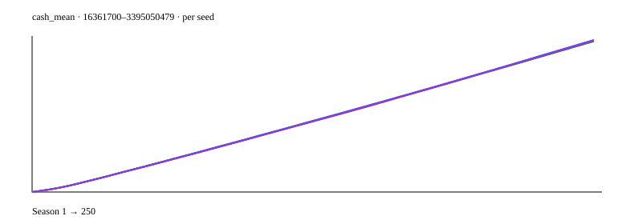
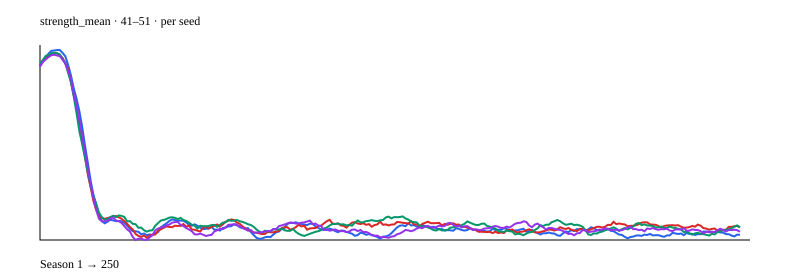

# Global balance measurement

All 38 rounds / 20 clubs / two divisions; production MatchEngine, career, salary, attendance, sponsor, market valuation and movement rules. Scales are pooled season counts across independent persistent seeded universes.

## Limits

- In-memory stress model excludes Mongo transaction behavior, cup income, stadium expansions and human decisions.
- Market acceptance and cash-flow timing are simplified: bounded cash-conserving transfers, annual 12-month accounting, free-agent positional replacement; not the complete BotManager negotiation loop.
- Injuries and red-card absence are measured from the engine; physical consequences use starter wear. Bench minutes and match ratings are not propagated in this stress model.
- Supporter counts and stadium capacity are held fixed; supporter growth and stadium ROI are covered by service tests, not this stress model.

## 10 seasons · 7600 matches

Metric | Mean | P50 | P90 | P99
--- | ---: | ---: | ---: | ---:
matches | 760.000 | 760.000 | 760.000 | 760.000
goals_per_match | 2.397 | 2.411 | 2.451 | 2.457
draw_rate | 0.271 | 0.279 | 0.287 | 0.288
home_win_rate | 0.386 | 0.379 | 0.403 | 0.409
cards_per_match | 0.128 | 0.126 | 0.137 | 0.151
injuries_per_match | 0.031 | 0.025 | 0.043 | 0.045
stronger_win_rate | 0.392 | 0.397 | 0.420 | 0.421
cash_mean | 21363260.780 | 22603792.100 | 28806396.200 | 28843559.600
cash_p90 | 24523833.600 | 25989196.000 | 33923600.000 | 34701200.000
cash_p10 | 18180933.600 | 18478728.000 | 22181940.000 | 23349572.000
revenue_mean | 22597618.500 | 22599615.000 | 22633050.000 | 22647225.000
payroll_mean | 16303789.590 | 16332691.200 | 16430445.900 | 16443942.000
debt_mean | 0.000 | 0.000 | 0.000 | 0.000
prizes_mean | 1382500.000 | 1382500.000 | 1382500.000 | 1382500.000
ticketing_mean | 3197690.000 | 3194000.000 | 3217500.000 | 3224600.000
sponsorship_mean | 6017428.500 | 6020280.000 | 6035400.000 | 6040125.000
transfer_volume | 17.900 | 18.000 | 19.000 | 20.000
transfer_value | 4719000.000 | 4670000.000 | 5280000.000 | 5340000.000
market_median | 644000.000 | 640000.000 | 660000.000 | 660000.000
market_p90 | 1190000.000 | 1190000.000 | 1210000.000 | 1210000.000
market_p99 | 1515000.000 | 1520000.000 | 1590000.000 | 1590000.000
talent_concentration | 0.027 | 0.027 | 0.027 | 0.028
strength_mean | 50.582 | 50.598 | 50.794 | 50.851
strength_p99 | 61.400 | 61.000 | 62.000 | 62.000
age_mean | 25.746 | 25.656 | 26.587 | 26.983
elite_share | 0.000 | 0.000 | 0.000 | 0.000
bankrupt_share | 0.000 | 0.000 | 0.000 | 0.000
cash_inequality | 0.584 | 0.566 | 0.651 | 0.666
lineup_quality | 55.189 | 55.155 | 55.590 | 55.655
development | 370.400 | 352.000 | 416.000 | 433.000
regression | 17.900 | 16.000 | 29.000 | 32.000
retirements | 0.000 | 0.000 | 0.000 | 0.000
youth_entries | 80.000 | 80.000 | 80.000 | 80.000
youth_promotions | 3.000 | 2.000 | 7.000 | 7.000
free_agent_entries | 3.700 | 1.000 | 9.000 | 10.000
promotions | 4.000 | 4.000 | 4.000 | 4.000
relegations | 4.000 | 4.000 | 4.000 | 4.000
champion_repeat | 0.000 | 0.000 | 0.000 | 0.000
walkovers | 0.000 | 0.000 | 0.000 | 0.000
credit_contracts | 0.000 | 0.000 | 0.000 | 0.000

Alerts:
- None in measured bands.

Measure a candidate rule change with paired seeds before changing production configuration.

## 100 seasons · 76000 matches

Metric | Mean | P50 | P90 | P99
--- | ---: | ---: | ---: | ---:
matches | 760.000 | 760.000 | 760.000 | 760.000
goals_per_match | 2.368 | 2.389 | 2.474 | 2.512
draw_rate | 0.277 | 0.276 | 0.299 | 0.314
home_win_rate | 0.375 | 0.374 | 0.396 | 0.412
cards_per_match | 0.127 | 0.126 | 0.146 | 0.151
injuries_per_match | 0.044 | 0.043 | 0.058 | 0.070
stronger_win_rate | 0.394 | 0.392 | 0.418 | 0.437
cash_mean | 119200479.119 | 110750269.100 | 223321161.500 | 249612933.500
cash_p90 | 138796121.080 | 130776576.000 | 253951820.000 | 281491360.000
cash_p10 | 99370360.960 | 89957152.000 | 190145052.000 | 215146400.000
revenue_mean | 22785110.250 | 22776525.000 | 22940945.000 | 23043560.000
payroll_mean | 13221942.564 | 13036356.300 | 16200000.000 | 16460843.700
debt_mean | 0.000 | 0.000 | 0.000 | 0.000
prizes_mean | 1382500.000 | 1382500.000 | 1382500.000 | 1382500.000
ticketing_mean | 3325581.500 | 3314950.000 | 3460800.000 | 3538500.000
sponsorship_mean | 6077028.750 | 6073830.000 | 6123285.000 | 6138090.000
transfer_volume | 17.460 | 18.000 | 20.000 | 20.000
transfer_value | 2780600.000 | 2540000.000 | 4360000.000 | 5280000.000
market_median | 434800.000 | 410000.000 | 640000.000 | 660000.000
market_p90 | 905000.000 | 890000.000 | 1200000.000 | 1210000.000
market_p99 | 1351300.000 | 1450000.000 | 1680000.000 | 1730000.000
talent_concentration | 0.028 | 0.028 | 0.029 | 0.030
strength_mean | 47.412 | 48.744 | 51.055 | 51.262
strength_p99 | 62.950 | 64.000 | 65.000 | 66.000
age_mean | 29.476 | 28.929 | 32.608 | 32.986
elite_share | 0.000 | 0.000 | 0.000 | 0.000
bankrupt_share | 0.000 | 0.000 | 0.000 | 0.000
cash_inequality | 0.555 | 0.539 | 0.702 | 0.773
lineup_quality | 53.057 | 54.874 | 56.634 | 56.818
development | 225.790 | 241.000 | 315.000 | 416.000
regression | 163.820 | 153.000 | 280.000 | 303.000
retirements | 41.610 | 45.000 | 81.000 | 95.000
youth_entries | 80.000 | 80.000 | 80.000 | 80.000
youth_promotions | 39.500 | 40.000 | 78.000 | 87.000
free_agent_entries | 1.980 | 1.000 | 6.000 | 10.000
promotions | 4.000 | 4.000 | 4.000 | 4.000
relegations | 4.000 | 4.000 | 4.000 | 4.000
champion_repeat | 0.120 | 0.000 | 1.000 | 1.000
walkovers | 1.610 | 0.000 | 0.000 | 38.000
credit_contracts | 0.000 | 0.000 | 0.000 | 0.000

Alerts:
- None in measured bands.

Measure a candidate rule change with paired seeds before changing production configuration.

## 1000 seasons · 760000 matches

Metric | Mean | P50 | P90 | P99
--- | ---: | ---: | ---: | ---:
matches | 760.000 | 760.000 | 760.000 | 760.000
goals_per_match | 2.243 | 2.234 | 2.329 | 2.474
draw_rate | 0.284 | 0.283 | 0.307 | 0.320
home_win_rate | 0.370 | 0.370 | 0.393 | 0.409
cards_per_match | 0.125 | 0.125 | 0.141 | 0.154
injuries_per_match | 0.045 | 0.045 | 0.057 | 0.064
stronger_win_rate | 0.388 | 0.388 | 0.413 | 0.434
cash_mean | 1617069948.006 | 1591164171.300 | 3019037754.000 | 3350557409.500
cash_p90 | 1775434616.728 | 1749623892.000 | 3319255720.000 | 3652679548.000
cash_p10 | 1439264820.600 | 1397642488.000 | 2700252788.000 | 2993071504.000
revenue_mean | 23828793.400 | 23826390.000 | 24662440.000 | 24918005.000
payroll_mean | 10342195.486 | 10029748.200 | 10467876.900 | 16200000.000
debt_mean | 0.000 | 0.000 | 0.000 | 0.000
prizes_mean | 1382500.000 | 1382500.000 | 1382500.000 | 1382500.000
ticketing_mean | 3887612.100 | 3882700.000 | 4357850.000 | 4564750.000
sponsorship_mean | 6558681.300 | 6587280.000 | 6934725.000 | 7020405.000
transfer_volume | 18.796 | 19.000 | 20.000 | 20.000
transfer_value | 1893180.000 | 1820000.000 | 2190000.000 | 4360000.000
market_median | 269190.000 | 250000.000 | 270000.000 | 640000.000
market_p90 | 619990.000 | 590000.000 | 620000.000 | 1200000.000
market_p99 | 892290.000 | 840000.000 | 910000.000 | 1680000.000
talent_concentration | 0.028 | 0.028 | 0.029 | 0.031
strength_mean | 41.868 | 41.273 | 41.873 | 51.055
strength_p99 | 55.239 | 54.000 | 58.000 | 65.000
age_mean | 29.963 | 30.000 | 30.755 | 32.608
elite_share | 0.000 | 0.000 | 0.000 | 0.000
bankrupt_share | 0.000 | 0.000 | 0.000 | 0.000
cash_inequality | 0.345 | 0.329 | 0.423 | 0.702
lineup_quality | 46.289 | 45.561 | 46.592 | 56.634
development | 207.234 | 205.000 | 241.000 | 315.000
regression | 184.066 | 186.000 | 218.000 | 280.000
retirements | 49.227 | 50.000 | 65.000 | 81.000
youth_entries | 80.000 | 80.000 | 80.000 | 80.000
youth_promotions | 48.632 | 50.000 | 63.000 | 78.000
free_agent_entries | 0.445 | 0.000 | 1.000 | 6.000
promotions | 4.000 | 4.000 | 4.000 | 4.000
relegations | 4.000 | 4.000 | 4.000 | 4.000
champion_repeat | 0.111 | 0.000 | 1.000 | 1.000
walkovers | 6.171 | 0.000 | 38.000 | 39.000
credit_contracts | 0.000 | 0.000 | 0.000 | 0.000

Alerts:
- None in measured bands.

Measure a candidate rule change with paired seeds before changing production configuration.

